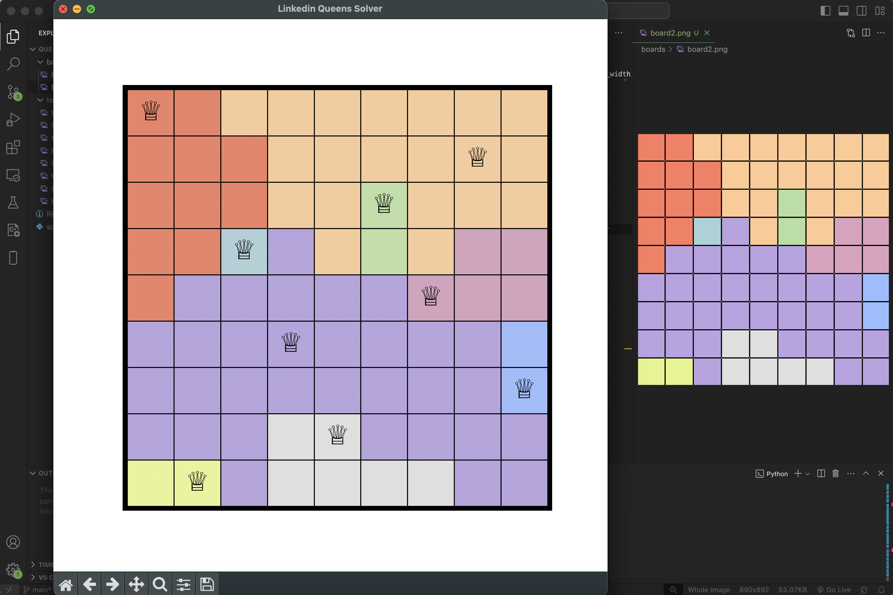

# Queens Bot

Solves the Linkedin Queens game in ~1 second using image detection and backtracking!

How it works:
 1. Open Queens on your laptop, take a screenshot the board (no edges) and exit
 2. Move the screenshot to the boards folder and rename it to board
 3. Solve the board by running this command: <strong>python3 solve.py board</strong>
 4. View your solved board visualization
 5. Open Queens on your phone and copy the visualization

Tools used:
 - Python (numpy, matplotlib, scipy)
